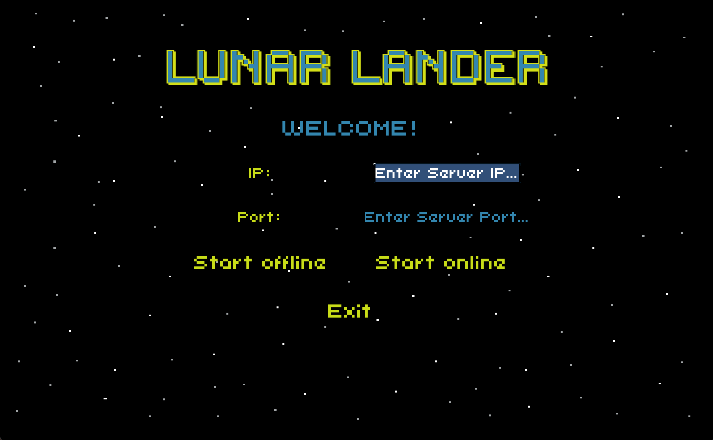

# LunarLander
> Our implementation of famous arcade game from 70's in Java language,

## Table of contents
* [General info](#general-info)
* [Screenshots](#screenshots)
* [Setup](#setup)
* [Technologies](#technologies)
* [Instruction](#instruction)
* [Server](#server)
* [Graphics](#graphics)
* [Contact](#contact)

## General info
Famous game implemented by me and my friend [@Jan Szewczyński](https://github.com/lulek1410) for a university subject. 

You are steering a Lunar Lander and you have to safely land it on the surface of a few different planets. You have to watch out for the asteorids!
If you land too dangerously, you can crash your lander. 
There is 8 levels, can you win the game?
There is a ranking where you can see your results, if you are good enough. 

Also, there is a local server prepared for the game. When you launch it, your scores are passed to the server and you can reach them only if you are connected to that server.

Our goal was to learn Java by creating a simple graphic game with GUI. 
The game works fine, but it was written in Java, using Swing GUI widget toolkit. And the Swing is quite old. 
Nevertheless, we learned quite a lot by writing this application.

Have fun!

## Screenshots

## Setup
In order to install, download the LunarLander.jar file and launch terminal in download folder.
Then on MacOS and Linux just type: `java -jar LunarLander.jar`
You have to install Java first, unless you have installed it before.

In order to install the server, you have to do the same things, but the code in terminal differs: `java -jar Server.jar`

## Technologies
* Java 11
* Swing GUI widget toolkit
* AWT

## Instruction
* After launching the game, you can choose whether you want to play offline or online. You can play online, only if th server was launched (from Server folder).
* No matter what you choosed, now you can see main menu. You can play by clicking Start!
* In the next window you can type your name, or just leave it empty. You'll be unkown player.
* The game starts! You have to safely land the lander on the surface of planet by using keyobard arrows. Landing space is flat.
* If asteroids hits you, you lose one lander. You have 4 landers. 
* You can pause the game any time by clicking || or space button.
* When you pass the level, you will see the next level.
* When you lose 4 landers, you lost the game!
* When you pass all 8 levels, you won!
* You can check if you had the best score by clicking Best Scores button in main menu. 
* You can display the instruction from the main menu.

## Server
We also have to implement a server with whom the game can connect. If you type correct IP adress and port number in the launch screen and click play online you will be connected to offline server. The server must be launched first. Then when you play, all the configuration files are handled by the server. Also the best scores are being sent to the server.

## Graphics
All the graphics was made by [@Jan](https://github.com/lulek1410). Excellent work!

## Status
Project is: _finished_

## Contact
Created by [@Eryk Mroczko](https://www.erykmroczko.pl/) and [@Jan Szewczyński](https://github.com/lulek1410).
Feel free to contact us!

## License
We don't have any rights to the name of the game and font used in application.
